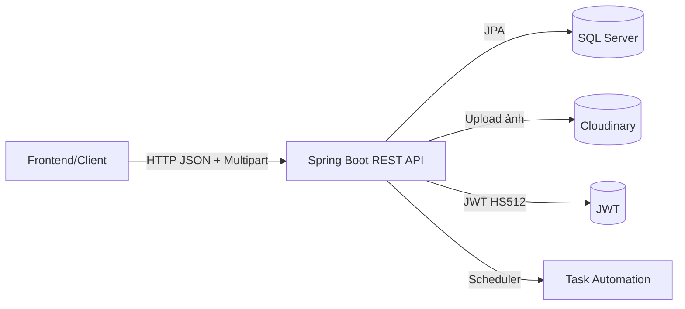
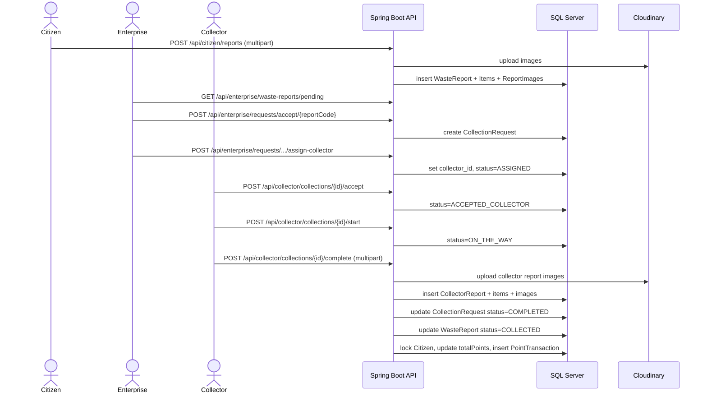

# Kiến thức code: Crowdsourced Waste Collection & Recycling System

Tài liệu này mô tả dự án **từ đầu đến cuối**: công nghệ sử dụng, cách các phần kết nối, và luồng nghiệp vụ theo các actor **Citizen / Enterprise / Collector / Reward**.

## Tổng quan

Hệ thống là một REST API (Spring Boot) phục vụ quy trình:
- Citizen tạo **WasteReport** (kèm ảnh, item theo category).
- Enterprise duyệt report, tạo **CollectionRequest**, phân công Collector.
- Collector nhận nhiệm vụ, cập nhật trạng thái, hoàn tất bằng **CollectorReport** (kèm ảnh).
- Reward: khi Collector hoàn tất, hệ thống **tính điểm** và cộng cho Citizen, lưu lịch sử **PointTransaction**.

Sơ đồ thành phần:



## Tech stack (dùng gì và vì sao)

Nền tảng:
- **Java + Spring Boot**: chuẩn cho REST API, bảo mật, validation, data access.
- **Maven**: quản lý dependency/build.

Thư viện chính (theo `pom.xml`):
- API/Web: `spring-boot-starter-web`, `spring-boot-starter-validation`
- DB/JPA: `spring-boot-starter-data-jpa`, driver `com.microsoft.sqlserver:mssql-jdbc`
- Security/JWT: `spring-boot-starter-security`, `spring-boot-starter-oauth2-resource-server`
- Upload ảnh: `com.cloudinary:cloudinary-http44`
- Swagger: `org.springdoc:springdoc-openapi-starter-webmvc-ui`
- Mapping/tooling: Lombok, MapStruct, ModelMapper

## Cấu hình (kết nối như nào)

File: `src/main/resources/application.yml`

- DB SQL Server: `spring.datasource.url/username/password/driver-class-name`
- JPA: `spring.jpa.hibernate.ddl-auto: update`, `show-sql: true`
- Multipart: `spring.servlet.multipart.max-file-size/max-request-size`
- JWT: `jwt.signerKey`, `jwt.valid-duration`
- Work rules: `workrule.*` (timeout nhận việc, SLA, suspend...)
- Cloudinary: `cloudinary.cloud-name/api-key/api-secret`

Lưu ý thực tế vận hành:
- `jwt.signerKey`, mật khẩu DB, và Cloudinary keys nên để qua env/secret manager (không hardcode).

### Seed data (dữ liệu mẫu khi chạy local)

Dự án có seeding mặc định khi `app.seed.enabled: true` trong `application.yml`.

- Entry: [DataSeeder.java](file:///d:/Documents/SWP/Crowdsourced-Waste-Collection-Recycling-System/src/main/java/com/team2/Crowdsourced_Waste_Collection_Recycling_System/config/DataSeeder.java)
- Cơ chế: `@ConditionalOnProperty` + `CommandLineRunner` → chạy mỗi lần app start (nếu bật seed).
- Seed những gì:
  - roles/permissions và gán permission vào role
  - users mẫu
  - waste categories (unit + point per unit)
  - một số dữ liệu flow mẫu (report/request/tracking/report/points/feedback)

Tài khoản test (dev) thường gặp (xem `DataSeeder`):
- Citizen: `citizen@test.com` / `citizen123`
- Citizen2: `citizen2@test.com` / `citizen123`
- Enterprise: `enterprise@test.com` / `enterprise123`
- Collector: `collector@test.com` / `collector123`
- Collector2: `collector2@test.com` / `collector123`
- Admin: `admin@test.com` / `admin123`


## Cấu trúc code (đọc theo folder)

Package chính: `com.team2.Crowdsourced_Waste_Collection_Recycling_System`

- `controller/`: REST endpoints theo nhóm actor/domain
- `service/` + `service/impl/`: nghiệp vụ
- `repository/`: JPA repository
- `entity/`: mô hình dữ liệu
- `enums/`: trạng thái workflow
- `converter/`: converter enum ↔ string DB
- `dto/`: request/response
- `config/`: security, swagger, cloudinary, workrule, seeder...
- `exception/`: chuẩn hóa lỗi (`ApiResponse`, `ErrorCode`, handler)

## Security & Auth (JWT/Roles)

### Endpoints auth

Controller: `controller/authentication/AuthController` (base `/api/auth`)

- `POST /api/auth/register`: tạo user và trả JWT
- `POST /api/auth/login` hoặc `POST /api/auth/token`: đăng nhập trả JWT
- `POST /api/auth/introspect`: kiểm tra token hợp lệ/chưa bị thu hồi
- `POST /api/auth/logout`: thu hồi token (denylist theo `jti`)

### Token phát hành/verify

- Phát hành token nằm ở `util/JWTHelper`:
  - thuật toán HS512
  - claim quan trọng: `sub`(email), `exp`, `jti`, `scope`
  - thêm `role`, `citizenId`, `collectorId`, `enterpriseId` để client biết “đang là profile nào”
- Xác thực token cho mọi request nằm ở `config/SecurityConfig` + `config/CustomJwtDecoder`:
  - public endpoints: auth + swagger
  - các endpoint khác: bắt buộc `authenticated()`
  - `CustomJwtDecoder` gọi `AuthService.introspect()` trước khi decode để chặn token đã logout

Code tham chiếu:
- Phát hành/verify JWT: [JWTHelper.java](file:///d:/Documents/SWP/Crowdsourced-Waste-Collection-Recycling-System/src/main/java/com/team2/Crowdsourced_Waste_Collection_Recycling_System/util/JWTHelper.java)
- Cấu hình security + map `scope` → authority: [SecurityConfig.java](file:///d:/Documents/SWP/Crowdsourced-Waste-Collection-Recycling-System/src/main/java/com/team2/Crowdsourced_Waste_Collection_Recycling_System/config/SecurityConfig.java)
- Decoder có introspect trước khi decode: [CustomJwtDecoder.java](file:///d:/Documents/SWP/Crowdsourced-Waste-Collection-Recycling-System/src/main/java/com/team2/Crowdsourced_Waste_Collection_Recycling_System/config/CustomJwtDecoder.java)
- Logout/denylist: [AuthServiceImpl.java](file:///d:/Documents/SWP/Crowdsourced-Waste-Collection-Recycling-System/src/main/java/com/team2/Crowdsourced_Waste_Collection_Recycling_System/service/impl/AuthServiceImpl.java)

Vì sao cần introspect/denylist:
- JWT vốn stateless, nếu không có denylist thì “logout” không có tác dụng cho đến khi token hết hạn.

## Data model & quan hệ chính

Mục tiêu phần này là giúp người đọc hiểu “bảng nào sinh ra bởi luồng nào”.

- User/RBAC
  - `User` → `Role` → `RolePermission` → `Permission`
  - token build `scope` từ role/permission
- Profiles
  - `Citizen` ↔ `User` (1-1)
  - `Collector` ↔ `User` (1-1), `Collector` → `Enterprise` (N-1)
- Waste report
  - `WasteReport` → `Citizen` (N-1)
  - `WasteReportItem` → `WasteReport` + `WasteCategory`
  - `ReportImage` → `WasteReport`
- Collection workflow
  - `CollectionRequest` → `WasteReport` + `Enterprise` + (optional) `Collector`
  - `CollectionTracking` → `CollectionRequest` (lưu lịch sử)
  - `CollectorReport` → `CollectionRequest` + `Collector`
  - `CollectorReportItem` → `CollectorReport` + `WasteCategory`
  - `CollectorReportImage` → `CollectorReport`
- Reward
  - `Citizen.totalPoints`: số dư điểm hiện tại
  - `PointTransaction`: lịch sử cộng/trừ điểm, có thể link tới report/request

### Các bảng chính (entity ↔ table)

Các entity đều có `@Table(name = ...)`, nên khi đọc DB bạn có thể map trực tiếp:

- `WasteReport` ↔ `waste_reports`: [WasteReport.java](file:///d:/Documents/SWP/Crowdsourced-Waste-Collection-Recycling-System/src/main/java/com/team2/Crowdsourced_Waste_Collection_Recycling_System/entity/WasteReport.java)
  - cột đáng chú ý: `report_code` (unique), `citizen_id`, `latitude/longitude`, `status`, `images` (cover), `cloudinary_public_id`
- `WasteReportItem` ↔ `waste_report_items`: `report_id`, `waste_category_id`, `unit_snapshot`, `quantity`
- `ReportImage` ↔ `report_images`: `report_id`, `image_url`, `image_type`, `uploaded_at`
- `WasteCategory` ↔ `waste_categories`: [WasteCategory.java](file:///d:/Documents/SWP/Crowdsourced-Waste-Collection-Recycling-System/src/main/java/com/team2/Crowdsourced_Waste_Collection_Recycling_System/entity/WasteCategory.java)
  - `unit` và `point_per_unit` là nền tảng để tính điểm
- `CollectionRequest` ↔ `collection_requests`: [CollectionRequest.java](file:///d:/Documents/SWP/Crowdsourced-Waste-Collection-Recycling-System/src/main/java/com/team2/Crowdsourced_Waste_Collection_Recycling_System/entity/CollectionRequest.java)
  - `request_code` (unique), `report_id`, `enterprise_id`, `collector_id`
  - các mốc thời gian: `assigned_at/accepted_at/started_at/collected_at/completed_at`
  - `actual_weight_kg` được chốt khi collector nộp report complete
- `CollectionTracking` ↔ `collection_tracking`: log `action/note/created_at` theo request
- `CollectorReport` ↔ `collector_reports`: [CollectorReport.java](file:///d:/Documents/SWP/Crowdsourced-Waste-Collection-Recycling-System/src/main/java/com/team2/Crowdsourced_Waste_Collection_Recycling_System/entity/CollectorReport.java)
  - `report_code` (unique), `collection_request_id`, `collector_id`, `total_point`, GPS thực tế
- `CollectorReportItem` ↔ `collector_report_items`: snapshot unit/point và `total_point` theo item
- `CollectorReportImage` ↔ `collector_report_images`: `image_url/public_id`
- `PointTransaction` ↔ `point_transactions`: [PointTransaction.java](file:///d:/Documents/SWP/Crowdsourced-Waste-Collection-Recycling-System/src/main/java/com/team2/Crowdsourced_Waste_Collection_Recycling_System/entity/PointTransaction.java)
  - link tới `citizen_id`, optional `report_id/collection_request_id`
  - `transaction_type` (ví dụ `EARN`), `points`, `balance_after`
- `Feedback` ↔ `feedbacks`: complaint/feedback của citizen (có thể gắn với request)
- `Leaderboard` ↔ `leaderboard`: dùng cho bảng xếp hạng (tuỳ cách populate)

## Status workflow (enum) & cách lưu DB

- `WasteReportStatus`: `PENDING`, `ACCEPTED_ENTERPRISE`, `ASSIGNED`, `ACCEPTED_COLLECTOR`, `ON_THE_WAY`, `COLLECTED`, `REJECTED`, `TIMED_OUT`
- `CollectionRequestStatus`: `PENDING`, `ACCEPTED_ENTERPRISE`, `ASSIGNED`, `ACCEPTED_COLLECTOR`, `ON_THE_WAY`, `COLLECTED`, `COMPLETED`, `REJECTED`
- `CollectorStatus`: `AVAILABLE`, `ACTIVE`, `INACTIVE`, `SUSPEND`
- `CollectorReportStatus`: `PENDING`, `COMPLETED`, `FAILED`

Enum được map xuống DB dạng string lowercase qua `converter/*StatusConverter.java`.

Chuỗi trạng thái thường gặp (ai thao tác):
- `WasteReportStatus`:
  - Citizen tạo: `PENDING`
  - Enterprise accept: `ACCEPTED_ENTERPRISE`
  - Enterprise assign: `ASSIGNED`
  - Collector accept: `ACCEPTED_COLLECTOR`
  - Collector start: `ON_THE_WAY`
  - Collector complete: `COLLECTED`
  - Enterprise/cơ chế khác reject/timeout: `REJECTED` / `TIMED_OUT`
- `CollectionRequestStatus`:
  - Enterprise accept report: `ACCEPTED_ENTERPRISE`
  - Enterprise assign: `ASSIGNED`
  - Collector accept: `ACCEPTED_COLLECTOR`
  - Collector start: `ON_THE_WAY`
  - Collector collected/complete: `COLLECTED` → `COMPLETED`
  - Enterprise/citizen huỷ hoặc reject: `REJECTED`

## Luồng nghiệp vụ theo từng actor

### 1) Citizen

Controller: `controller/citizen/CitizenController` (base `/api/citizen`)

- Report
  - `POST /api/citizen/reports` (multipart): tạo báo cáo
  - `PUT /api/citizen/reports/{id}` (multipart): cập nhật
  - `DELETE /api/citizen/reports/{id}`: huỷ
  - `GET /api/citizen/reports`: danh sách của tôi
  - `GET /api/citizen/reports/{id}`: chi tiết (Citizen/Enterprise đều có thể xem)
  - `GET /api/citizen/reports/{id}/result`: xem kết quả xử lý
- Reward
  - `GET /api/citizen/rewards/history`: lịch sử điểm
  - `GET /api/citizen/leaderboard`: bảng xếp hạng
- Khác
  - `POST /api/citizen/complaints`, `GET /api/citizen/complaints`
  - `GET /api/citizen/waste-categories`

Kiến thức luồng:
- Citizen chỉ tạo/sửa/xoá report của mình; report thường khởi đầu ở `PENDING`.

### 2) Enterprise

Controllers:
- `EnterpriseWasteReportController` (base `/api/enterprise/waste-reports`)
- `EnterpriseController` (base `/api/enterprise/requests`)
- `EnterpriseCollectorController` (base `/api/enterprise/collectors`)

- Duyệt report
  - `GET /api/enterprise/waste-reports` (lọc status)
  - `GET /api/enterprise/waste-reports/pending`
  - `GET /api/enterprise/waste-reports/{id}`
- Tạo request/assign
  - `POST /api/enterprise/requests/accept/{reportCode}`: accept → tạo `CollectionRequest`
  - `POST /api/enterprise/requests/reject/{reportCode}`: reject report
  - `GET /api/enterprise/requests/{requestId}/eligible-collectors`
  - `POST /api/enterprise/requests/reports/{reportCode}/assign-collector`
  - `GET /api/enterprise/requests/{requestId}/report-detail`: ghép waste report + collector report
- Quản lý collector thuộc enterprise
  - `POST /api/enterprise/collectors`
  - `GET /api/enterprise/collectors`

Kiến thức luồng:
- Accept report sẽ tạo `CollectionRequest` tương ứng.
- Assign gắn `collector_id` và đưa request vào chuỗi trạng thái để Collector nhận.

### 3) Collector

Controller: `controller/collector/CollectionController` (base `/api/collector/collections`)

- Task
  - `GET /tasks`: xem danh sách nhiệm vụ
  - `POST /{requestId}/accept`: nhận task
  - `POST /{requestId}/start`: bắt đầu
  - `POST /{requestId}/reject`: từ chối (đẩy về enterprise)
  - `POST /{requestId}/collected`: đánh dấu đã thu gom
  - `PATCH /{requestId}/status`: update trạng thái (tiến về phía trước)
- Báo cáo thu gom
  - `GET /{requestId}/create_report`: lấy data tạo report
  - `POST /{requestId}/complete` (multipart): tạo `CollectorReport` + ảnh, hoàn tất request
  - `GET /{requestId}/report`, `GET /list_reports`, `GET /reports/{reportId}`

Kiến thức luồng:
- “Complete” là bước quan trọng nhất vì cập nhật đồng thời: collector report + request status + waste report status + reward.

### 4) Reward

Reward là nghiệp vụ đi kèm luồng complete.

Service: `service/impl/CollectorReportCreationService`

- Tính điểm theo item * `WasteCategory.pointPerUnit`.
- Chống cộng trùng:
  - check `PointTransactionRepository.existsByCollectionRequestIdAndTransactionType(..., "EARN")`
  - lock `Citizen` bằng `CitizenRepository.findByIdForUpdate()` (pessimistic write)
  - double-check lần nữa trước khi insert
- Persist:
  - update `Citizen.totalPoints`
  - insert `PointTransaction`

Vì sao cần lock + idempotency:
- Multipart + mạng có thể retry; nếu không chống trùng sẽ sai số điểm.

## Upload ảnh (Cloudinary)

- Bean: `config/CloudinaryConfig`
- Service: `service/impl/CloudinaryServiceImpl`

Luồng dùng:
- Controller nhận `MultipartFile` → gọi `CloudinaryService.uploadImage(file, module)` → nhận `url/publicId` → lưu vào bảng image.

## Automation (timeout/SLA)

Service: `service/impl/TaskAutomationServiceImpl`

- Mỗi 5 phút: kiểm tra task `ASSIGNED` quá hạn nhận (`workrule.accept-timeout-hours`) để xử lý reassignment.
- Mỗi 1 giờ: kiểm tra SLA (`workrule.sla-hours`), tăng vi phạm và có thể `SUSPEND` collector khi vượt `workrule.suspend-threshold`.

## Chuẩn response & lỗi

- Response wrapper: `dto/response/ApiResponse<T>` (`code`, `message`, `result`).
- Lỗi business thường map qua `exception/ErrorCode`.
- Lỗi auth (401) xử lý qua `JwtAuthenticationEntryPoint`.

## Sequence flow mẫu (Citizen → Enterprise → Collector → Reward)



## Gợi ý đọc code theo tuyến

1) Auth: `AuthController` → `AuthServiceImpl` → `JWTHelper` → `SecurityConfig`/`CustomJwtDecoder`
2) Citizen report: `CitizenController` → service report → `WasteReport/*Item/*Image`
3) Enterprise accept/assign: `Enterprise*Controller` → service request/assignment → `CollectionRequest`
4) Collector complete: `CollectionController` → `CollectorReportCreationService`
5) Reward: `CollectorReportCreationService.rewardCitizen` → `CitizenRepository.findByIdForUpdate` → `PointTransactionRepository`
6) Automation: `TaskAutomationServiceImpl` + `WorkRuleProperties`

## Lưu ý khi mở rộng

- Thêm status mới: cập nhật enum + converter + các query dùng literal string.
- Thêm endpoint: gắn `@PreAuthorize` đúng role/permission.
- Nghiệp vụ có thể retry: thiết kế idempotent (như reward chống cộng trùng).
- Secrets: dùng env vars, tránh commit khóa bí mật.

## Luồng chi tiết theo code (end-to-end)

Phần này đi sâu “code chạy ra sao” theo đúng các service/repository hiện có.

### A) Citizen tạo WasteReport (multipart)

DTO request:
- [CreateWasteReportRequest.java](file:///d:/Documents/SWP/Crowdsourced-Waste-Collection-Recycling-System/src/main/java/com/team2/Crowdsourced_Waste_Collection_Recycling_System/dto/request/CreateWasteReportRequest.java)

Luồng thực thi:
- Entry: `CitizenController.POST /api/citizen/reports` → `WasteReportServiceImpl.createReport(...)`.
- Core service: [createReport](file:///d:/Documents/SWP/Crowdsourced-Waste-Collection-Recycling-System/src/main/java/com/team2/Crowdsourced_Waste_Collection_Recycling_System/service/impl/WasteReportServiceImpl.java#L98-L192)

Các bước quan trọng trong `createReport`:
- Lấy citizen theo email từ JWT: `citizenRepository.findByUser_Email(citizenEmail)`.
- Validate input:
  - ảnh tối thiểu 1 tấm (`@Size(min=1)`),
  - phải có ít nhất 1 category,
  - lat/lng bắt buộc và trong range.
- Chuẩn hoá toạ độ: lat/lng scale 8 chữ số thập phân.
- Anti-spam / chống báo cáo trùng (near-duplicate):
  - đếm report gần nhau trong **10 phút** quanh (lat/lng) với `countRecentNearDuplicate(...)` và chặn nếu `>0`.
  - có tính `todayReports` nhưng hiện chưa dùng để giới hạn theo ngày.
- Tạo `WasteReport`:
  - `status = PENDING`
  - `wasteType` đang hardcode `RECYCLABLE`
  - `reportCode` tạm `TMP...` rồi save lấy id và đổi thành `WR%03d`.
- Resolve `categoryIds`:
  - input là `List<String>` (có thể là id hoặc tên),
  - convert sang `List<Integer>` và load `WasteCategory`.
- Tạo `WasteReportItem`:
  - snapshot `unit` từ category (`unitSnapshot`),
  - lưu `quantity` theo thứ tự input.
- Upload ảnh:
  - gọi `CloudinaryService.uploadImage(file, "reports")`
  - lưu `ReportImage` cho từng ảnh
  - đồng thời set ảnh cover vào `WasteReport.images` + `cloudinaryPublicId`.
  - xem [saveReportImages](file:///d:/Documents/SWP/Crowdsourced-Waste-Collection-Recycling-System/src/main/java/com/team2/Crowdsourced_Waste_Collection_Recycling_System/service/impl/WasteReportServiceImpl.java#L617-L638) và [CloudinaryServiceImpl.uploadImage](file:///d:/Documents/SWP/Crowdsourced-Waste-Collection-Recycling-System/src/main/java/com/team2/Crowdsourced_Waste_Collection_Recycling_System/service/impl/CloudinaryServiceImpl.java#L37-L69).

Ví dụ payload (ý nghĩa field):
- `images[]`: ảnh hiện trường
- `categoryIds[]`: danh mục (string)
- `quantities[]`: số lượng/khối lượng ứng với từng category
- `latitude/longitude/address/description`: vị trí và mô tả

### B) Citizen cập nhật/huỷ report

- Update chỉ cho phép khi report còn `PENDING`:
  - [updateReport](file:///d:/Documents/SWP/Crowdsourced-Waste-Collection-Recycling-System/src/main/java/com/team2/Crowdsourced_Waste_Collection_Recycling_System/service/impl/WasteReportServiceImpl.java#L205-L287)
- Delete chỉ cho phép khi:
  - report thuộc citizen,
  - `status=PENDING`,
  - chưa có `CollectionRequest` nào tạo từ report.

### C) Enterprise accept report → tạo CollectionRequest

Service chính:
- `EnterpriseController.POST /api/enterprise/requests/accept/{reportCode}`
- `EnterpriseRequestServiceImpl.acceptWasteReport(...)`: [EnterpriseRequestServiceImpl.java](file:///d:/Documents/SWP/Crowdsourced-Waste-Collection-Recycling-System/src/main/java/com/team2/Crowdsourced_Waste_Collection_Recycling_System/service/impl/EnterpriseRequestServiceImpl.java#L32-L110)

Điểm đáng học:
- **Idempotent** theo `reportCode`:
  - Nếu report `PENDING` → accept + create request.
  - Nếu report đã `ACCEPTED_ENTERPRISE` → đảm bảo có request (thiếu thì tạo) và trả về id.
  - Trạng thái khác → reject.
- “Service area check” theo address:
  - enterprise có `serviceWards`/`serviceCities` (string CSV).
  - `isInServiceArea(...)` kiểm tra address có chứa các ward/city đó.
- Code `requestCode`:
  - khởi tạo dạng `CR-YYYYMMDD-XXXXX` để tránh trùng,
  - sau khi có id thì overwrite về `CR%03d`.

### D) Enterprise assign collector (atomic update + tracking)

Service: `EnterpriseAssignmentServiceImpl.assignCollector(...)`:
- [EnterpriseAssignmentServiceImpl.java:L39-L114](file:///d:/Documents/SWP/Crowdsourced-Waste-Collection-Recycling-System/src/main/java/com/team2/Crowdsourced_Waste_Collection_Recycling_System/service/impl/EnterpriseAssignmentServiceImpl.java#L39-L114)

Các bước:
- Validate collector thuộc enterprise và status `ACTIVE|AVAILABLE`.
- Assign theo hướng atomic ở repo:
  - `collectionRequestRepository.assignCollector(requestId, collectorId, enterpriseId)`
  - chỉ update khi request đang `ACCEPTED_ENTERPRISE`, chưa có collector.
  - xem query native ở [CollectionRequestRepository.java:L82-L101](file:///d:/Documents/SWP/Crowdsourced-Waste-Collection-Recycling-System/src/main/java/com/team2/Crowdsourced_Waste_Collection_Recycling_System/repository/collector/CollectionRequestRepository.java#L82-L101)
- Đồng bộ `WasteReport.status = ASSIGNED`.
- Tạo `CollectionTracking` action `assigned`.

Vì sao cần “atomic update”:
- Tránh race condition khi nhiều admin/enterprise thao tác assign cùng lúc.

### E) Enterprise tìm collector phù hợp

`findEligibleCollectors(...)`:
- [EnterpriseAssignmentServiceImpl.java:L151-L199](file:///d:/Documents/SWP/Crowdsourced-Waste-Collection-Recycling-System/src/main/java/com/team2/Crowdsourced_Waste_Collection_Recycling_System/service/impl/EnterpriseAssignmentServiceImpl.java#L151-L199)

Logic hiện tại:
- Lọc collector `ACTIVE|AVAILABLE`, loại `SUSPEND`.
- Tính `online` nếu `lastLocationUpdate` trong 15 phút.
- Tính `activeTaskCount` bằng cách count các status `ASSIGNED/ACCEPTED_COLLECTOR/ON_THE_WAY`.
- Sort: online trước, rồi ít task trước.

### F) Collector workflow: accept → start → collected (chưa chốt điểm)

Service: `CollectorServiceImpl`:
- accept: [CollectorServiceImpl.java:L121-L134](file:///d:/Documents/SWP/Crowdsourced-Waste-Collection-Recycling-System/src/main/java/com/team2/Crowdsourced_Waste_Collection_Recycling_System/service/impl/CollectorServiceImpl.java#L121-L134)
- start: [CollectorServiceImpl.java:L136-L150](file:///d:/Documents/SWP/Crowdsourced-Waste-Collection-Recycling-System/src/main/java/com/team2/Crowdsourced_Waste_Collection_Recycling_System/service/impl/CollectorServiceImpl.java#L136-L150)
- collected: [CollectorServiceImpl.java:L172-L185](file:///d:/Documents/SWP/Crowdsourced-Waste-Collection-Recycling-System/src/main/java/com/team2/Crowdsourced_Waste_Collection_Recycling_System/service/impl/CollectorServiceImpl.java#L172-L185)

Repo cập nhật status theo hướng atomic:
- accept: [CollectionRequestRepository.acceptTask](file:///d:/Documents/SWP/Crowdsourced-Waste-Collection-Recycling-System/src/main/java/com/team2/Crowdsourced_Waste_Collection_Recycling_System/repository/collector/CollectionRequestRepository.java#L318-L332)
- start: [CollectionRequestRepository.updateStatusIfMatch](file:///d:/Documents/SWP/Crowdsourced-Waste-Collection-Recycling-System/src/main/java/com/team2/Crowdsourced_Waste_Collection_Recycling_System/repository/collector/CollectionRequestRepository.java#L302-L316)
- collected: [CollectionRequestRepository.completeTask](file:///d:/Documents/SWP/Crowdsourced-Waste-Collection-Recycling-System/src/main/java/com/team2/Crowdsourced_Waste_Collection_Recycling_System/repository/collector/CollectionRequestRepository.java#L359-L372)

Đồng bộ trạng thái `WasteReport`:
- Sau mỗi bước, hệ thống update `WasteReport.status` theo `CollectionRequest` để citizen/enterprise nhìn thấy tiến độ.
- Xem [updateWasteReportStatusIfPresent](file:///d:/Documents/SWP/Crowdsourced-Waste-Collection-Recycling-System/src/main/java/com/team2/Crowdsourced_Waste_Collection_Recycling_System/service/impl/CollectorServiceImpl.java#L208-L217).

### G) Collector tạo CollectorReport & chốt hoàn tất + reward

Endpoint: `POST /api/collector/collections/{requestId}/complete` (multipart)

DTO request:
- [CreateCollectorReportRequest.java](file:///d:/Documents/SWP/Crowdsourced-Waste-Collection-Recycling-System/src/main/java/com/team2/Crowdsourced_Waste_Collection_Recycling_System/dto/request/CreateCollectorReportRequest.java)

Service chính:
- [CollectorReportCreationService.createCollectorReport](file:///d:/Documents/SWP/Crowdsourced-Waste-Collection-Recycling-System/src/main/java/com/team2/Crowdsourced_Waste_Collection_Recycling_System/service/impl/CollectorReportCreationService.java#L59-L78)

Các bước trong `createCollectorReport`:
- Guardrails:
  - requestId/collectorId không null.
  - request phải thuộc collector.
  - request phải đang `COLLECTED`.
  - report cho request này chưa tồn tại (`existsByCollectionRequest_Id`).
  - xem [getAndValidateCollectionRequest](file:///d:/Documents/SWP/Crowdsourced-Waste-Collection-Recycling-System/src/main/java/com/team2/Crowdsourced_Waste_Collection_Recycling_System/service/impl/CollectorReportCreationService.java#L80-L98).
- Anti-fraud theo GPS:
  - tính khoảng cách (Haversine) giữa vị trí report ban đầu và GPS thực tế.
  - nếu vượt `workrule.reportRadiusKm` → reject.
  - xem [validateGpsWithinRadius](file:///d:/Documents/SWP/Crowdsourced-Waste-Collection-Recycling-System/src/main/java/com/team2/Crowdsourced_Waste_Collection_Recycling_System/service/impl/CollectorReportCreationService.java#L108-L118).
- Validate payload: có ảnh, categoryIds >= 1, quantities size khớp.
- Tính toán items:
  - load `WasteCategory` theo id
  - snapshot `unit` + `pointPerUnit`
  - `points = quantity * pointPerUnit` (int)
  - `totalWeightKg` chỉ cộng khi unit = `KG`
  - bắt buộc tổng kg > 0
  - xem [calculateItems](file:///d:/Documents/SWP/Crowdsourced-Waste-Collection-Recycling-System/src/main/java/com/team2/Crowdsourced_Waste_Collection_Recycling_System/service/impl/CollectorReportCreationService.java#L136-L173)
- Persist:
  - tạo `CollectorReport` status `COMPLETED`, set `collectorNote`, `totalPoint`, lat/lng.
  - tạo `reportCode` theo `CRR%06d`.
  - lưu items.
  - upload ảnh vào Cloudinary module `collectorReport`, lưu `CollectorReportImage`.
- Chốt hoàn tất task:
  - update `CollectionRequest` từ `COLLECTED` → `COMPLETED` + set `actual_weight_kg`.
  - repo update atomic: [confirmCompletedWithWeight](file:///d:/Documents/SWP/Crowdsourced-Waste-Collection-Recycling-System/src/main/java/com/team2/Crowdsourced_Waste_Collection_Recycling_System/repository/collector/CollectionRequestRepository.java#L394-L409)
- Đồng bộ `WasteReport.status = COLLECTED`.
- Reward citizen:
  - chống cộng trùng theo `(collectionRequestId, transactionType=EARN)`.
  - lock citizen pessimistic write.
  - update `Citizen.totalPoints` và insert `PointTransaction`.
  - xem [rewardCitizen](file:///d:/Documents/SWP/Crowdsourced-Waste-Collection-Recycling-System/src/main/java/com/team2/Crowdsourced_Waste_Collection_Recycling_System/service/impl/CollectorReportCreationService.java#L237-L279) và [CitizenRepository.findByIdForUpdate](file:///d:/Documents/SWP/Crowdsourced-Waste-Collection-Recycling-System/src/main/java/com/team2/Crowdsourced_Waste_Collection_Recycling_System/repository/profile/CitizenRepository.java#L14-L25).

Vì sao tách 2 bước `COLLECTED` → `complete report` → `COMPLETED`:
- `COLLECTED` dùng để đánh dấu “đã thu gom xong tại hiện trường”.
- `COMPLETED` là “đã nộp báo cáo + chốt khối lượng + chốt điểm”.
- Tách bước giúp:
  - workflow rõ ràng,
  - tránh chốt điểm khi chưa có evidence (ảnh + item thực tế),
  - dễ debug khi collector quên nộp report.

### H) Complaint (khiếu nại) & rule POINT

Service: `WasteReportServiceImpl.createComplaint(...)`:
- [WasteReportServiceImpl.java:L483-L517](file:///d:/Documents/SWP/Crowdsourced-Waste-Collection-Recycling-System/src/main/java/com/team2/Crowdsourced_Waste_Collection_Recycling_System/service/impl/WasteReportServiceImpl.java#L483-L517)

Điểm đáng học:
- Normalize complaint `type`: trim/uppercase/space→underscore.
- Với type `POINT`:
  - bắt buộc report có `CollectionRequest`
  - và đã có `PointTransaction EARN` cho request đó.
  - mục tiêu: chỉ cho khiếu nại điểm khi thực sự đã phát sinh điểm.

### I) Automation: timeout nhận việc & SLA

Service: `TaskAutomationServiceImpl` + `WorkRuleProperties`.

- Timeout nhận task:
  - job định kỳ tìm task `ASSIGNED` quá hạn nhận.
  - nếu không tìm được collector phù hợp để reassign → unassign về `ACCEPTED_ENTERPRISE`.
  - đồng bộ `WasteReport.status` theo trạng thái mới.

## Ví dụ gọi API (cURL/Postman)

Các ví dụ dưới đây mang tính “mẫu”, field name bám theo DTO và controller. Khi dùng Postman, bạn chỉ cần chọn đúng method + url + set header `Authorization`.

### 1) Đăng nhập lấy token

```bash
curl -X POST http://localhost:8080/api/auth/login \
  -H "Content-Type: application/json" \
  -d '{"email":"user@example.com","password":"your-password"}'
```

Lấy token từ `result.token` (tùy response thực tế).

### 2) Citizen tạo report (multipart)

DTO: [CreateWasteReportRequest.java](file:///d:/Documents/SWP/Crowdsourced-Waste-Collection-Recycling-System/src/main/java/com/team2/Crowdsourced_Waste_Collection_Recycling_System/dto/request/CreateWasteReportRequest.java)

```bash
curl -X POST http://localhost:8080/api/citizen/reports \
  -H "Authorization: Bearer $TOKEN" \
  -F "images=@D:\\path\\img1.jpg" \
  -F "images=@D:\\path\\img2.jpg" \
  -F "categoryIds=1" \
  -F "categoryIds=2" \
  -F "quantities=2.5" \
  -F "quantities=1.0" \
  -F "latitude=10.762622" \
  -F "longitude=106.660172" \
  -F "address=Q.10, TP.HCM" \
  -F "description=Rác tái chế trước nhà"
```

Ghi chú:
- `categoryIds` là `List<String>`, gửi nhiều lần để tạo list.
- `quantities` phải cùng số phần tử với `categoryIds`.

### 3) Enterprise accept report (tạo request)

```bash
curl -X POST http://localhost:8080/api/enterprise/requests/accept/WR001 \
  -H "Authorization: Bearer $ENTERPRISE_TOKEN"
```

### 4) Enterprise assign collector

DTO: [AssignCollectorRequest.java](file:///d:/Documents/SWP/Crowdsourced-Waste-Collection-Recycling-System/src/main/java/com/team2/Crowdsourced_Waste_Collection_Recycling_System/dto/request/AssignCollectorRequest.java)

```bash
curl -X POST http://localhost:8080/api/enterprise/requests/reports/WR001/assign-collector \
  -H "Authorization: Bearer $ENTERPRISE_TOKEN" \
  -H "Content-Type: application/json" \
  -d '{"collectorId":3}'
```

### 5) Collector nhận task → start → collected

```bash
curl -X POST http://localhost:8080/api/collector/collections/1/accept \
  -H "Authorization: Bearer $COLLECTOR_TOKEN"

curl -X POST http://localhost:8080/api/collector/collections/1/start \
  -H "Authorization: Bearer $COLLECTOR_TOKEN"

curl -X POST http://localhost:8080/api/collector/collections/1/collected \
  -H "Authorization: Bearer $COLLECTOR_TOKEN"
```

### 6) Collector nộp CollectorReport (multipart) để chốt COMPLETED + reward

DTO: [CreateCollectorReportRequest.java](file:///d:/Documents/SWP/Crowdsourced-Waste-Collection-Recycling-System/src/main/java/com/team2/Crowdsourced_Waste_Collection_Recycling_System/dto/request/CreateCollectorReportRequest.java)

```bash
curl -X POST http://localhost:8080/api/collector/collections/1/complete \
  -H "Authorization: Bearer $COLLECTOR_TOKEN" \
  -F "images=@D:\\path\\after1.jpg" \
  -F "categoryIds=1" \
  -F "quantities=3.2" \
  -F "collectorNote=Đã thu gom đầy đủ" \
  -F "latitude=10.762600" \
  -F "longitude=106.660100"
```

Ghi chú:
- Endpoint này chỉ chạy khi `CollectionRequest.status = COLLECTED`.
- GPS thực tế phải nằm trong bán kính `workrule.reportRadiusKm` so với vị trí report.


## Kiến thức học được (notes để onboard người mới)

### 1) Thiết kế API REST trong dự án

- Phân nhóm theo actor bằng base path rõ ràng: `/api/citizen`, `/api/enterprise`, `/api/collector`.
- Các thao tác tạo/cập nhật có file ảnh dùng `multipart/form-data`.
- Các thao tác query/list thường dùng query param (`status`, `all`, `startDate/endDate`...).

Điểm cần nhớ khi làm multipart:
- DTO + file upload thường tách rõ phần “metadata” và `MultipartFile[]`.
- Luồng tạo dữ liệu nên làm theo thứ tự: validate → upload ảnh → persist DB (hoặc persist trước rồi update ảnh tùy yêu cầu rollback).

### 2) Validation & DTO

- `spring-boot-starter-validation` hỗ trợ validate input bằng annotation.
- Quy ước nên áp dụng khi thêm endpoint:
  - validate input ngay ở boundary (controller/service entry)
  - báo lỗi rõ ràng, thống nhất format response

### 3) Mapping (MapStruct vs ModelMapper)

- MapStruct phù hợp mapping compile-time, rõ ràng, chạy nhanh.
- ModelMapper tiện khi mapping đơn giản/linh hoạt nhưng có thể khó debug khi mapping phức tạp.

Khuyến nghị:
- Với response phức tạp (có list item/imageUrls), ưu tiên mapping “tường minh” (hoặc MapStruct) để dễ đọc.

### 4) JPA/Hibernate: transaction, khóa, và tính nhất quán

- Khi thao tác nhiều bảng trong một nghiệp vụ (vd: complete), luôn xem xét `@Transactional` để đảm bảo atomic.
- Khi có khả năng “retry/double submit”, cần **idempotency**:
  - ví dụ reward: kiểm tra `existsBy...` trước và sau khi lock.

Vì sao dùng `PESSIMISTIC_WRITE` cho reward:
- `Citizen.totalPoints` là số dư tổng, dễ bị race condition khi cập nhật đồng thời.
- Lock hàng `Citizen` giúp tránh lost update.

### 5) Enum status & converter

- Lưu enum dưới dạng string lowercase giúp DB dễ đọc và filter.
- Khi viết query native/JPQL có literal status, phải thống nhất lowercase theo converter.

### 6) Spring Security/JWT: “scope” và `@PreAuthorize`

- Token chứa `scope` gồm `ROLE_<ROLE>` + permission code.
- Security config bỏ prefix mặc định để dùng thẳng `hasRole('...')`/`hasAnyRole(...)`.

Kiến thức quan trọng:
- “Logout JWT” không giống session logout. Dự án dùng denylist (`invalidated_tokens`) để vô hiệu hóa token trước hạn.

### 7) Upload ảnh: lưu file ở Cloudinary, lưu metadata ở DB

- DB chỉ nên lưu `url` (và `publicId` nếu cần delete).
- Cloudinary module folder được normalize (chỉ chấp nhận một số module) để dữ liệu đồng nhất.

### 8) Scheduler & nghiệp vụ nền

- Scheduler phù hợp cho các quy tắc vận hành: timeout nhận việc, SLA, auto-suspend.
- Các tham số nên cấu hình hóa (`workrule.*`) thay vì hardcode để dễ tinh chỉnh.

### 9) Error handling thống nhất

- Response wrapper `ApiResponse<T>` giúp client parse nhất quán.
- `ErrorCode` gom mã lỗi + http status → dễ maintain và log.

### 10) Checklist khi thêm feature mới

- Xác định actor nào được phép gọi → thêm `@PreAuthorize` đúng role/permission.
- Xác định status nào được phép chuyển → validate “status transition” (không cho nhảy lùi tùy tiện).
- Xác định nghiệp vụ có thể retry không → thiết kế idempotent (unique constraint / exists check / lock).
- Xác định có file upload không → validate file, giới hạn size, xử lý lỗi upload.
- Xác định có job nền liên quan không → config qua `workrule.*`/properties.

### 11) Cách kiểm tra nhanh khi chạy local

- Swagger UI: mở `http://localhost:8080/swagger-ui.html`.
- Các endpoint yêu cầu auth: gửi header `Authorization: Bearer <token>`.
- Khi debug reward/complete:
  - xem trạng thái request/report trước-sau
  - kiểm tra `point_transactions` có bị insert trùng hay không
  - kiểm tra `citizen.totalPoints` có bị cộng đúng không
